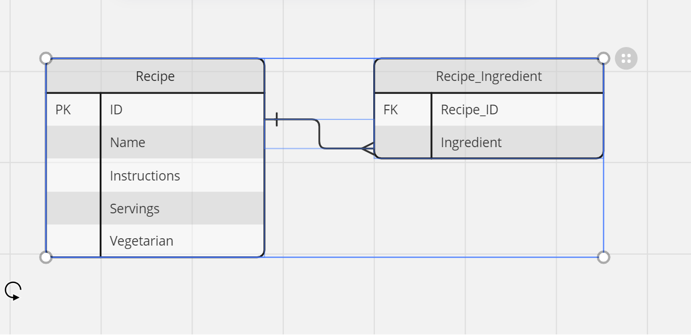
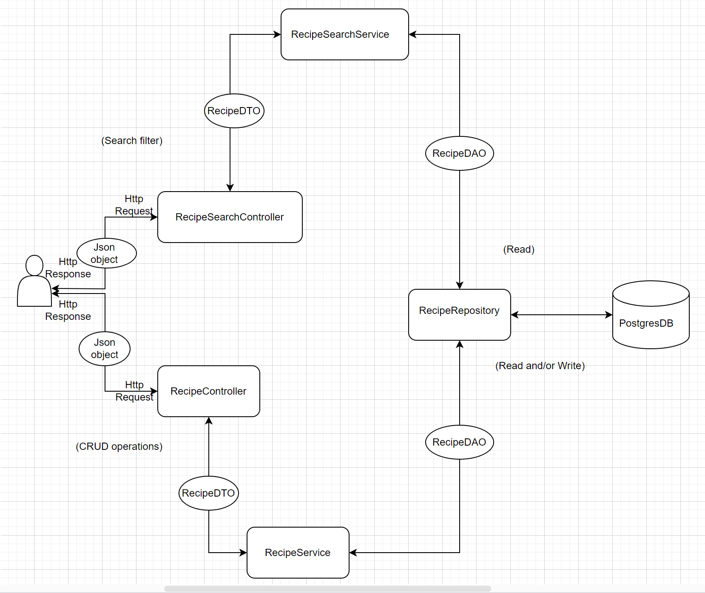

# Architectural Choices Documentation

### The Recipe Entity ER_DIAGRAM

### The Recipe Architectural DIAGRAM

## Framework:

##### **Choice:** Spring Boot

###### Reasoning:

- `Spring Boot` provides a robust and comprehensive framework for building RESTful APIs in Java.
- Its convention-over-configuration approach reduces boilerplate code and simplifies setup.
- Additionally, Spring Boot offers extensive support for dependency injection, data access, testing, and documentation, making it an ideal choice for this project.

## Database:

##### **Choice:** PostgreSQL

###### Reasoning:

- `PostgreSQL` is a powerful, open-source relational database management system with strong support for 
    ACID (Atomicity, Consistency, Isolation, and Durability) transactions, data integrity, and scalability.
    Third-party extensions can be used to operate PostgreSQL in a distributed environment when needed.
    It provides features like JSONB data type, which can be useful for storing flexible recipe data.
    Furthermore, Spring Boot seamlessly integrates with PostgreSQL through Spring Data JPA, simplifying database setup and interaction.

- `H2` in memory database for testing. Carrying out CRUD operations with H2 within Spring Boot is the same as with other SQL databases.
  It is easy to set up and use, and it provides a fast and reliable way to test your code.

#### Database Migration

##### **Choice:** Liquibase

###### Reasoning:

- `Liquibase` for automatic database migrations. It is a database schema change management solution that enables you to revise
    and release database changes faster and safer from development to production

## Testing Strategy:

##### Unit Tests: 

- Unit tests are written for individual components such as service classes and repository classes. 
  Mocking frameworks like Mockito is used to isolate dependencies and ensure that each component behaves as expected in isolation.

##### Integration Tests: 

- Integration tests are written to verify the interaction between different layers of the application, including the 
  REST endpoints, service layer, and database. Spring Boot Test and MockMvc are used to simulate HTTP requests and test
    the application's behavior in a real-world scenario.

###### Reasoning:

- A combination of unit tests and integration tests ensures comprehensive test coverage, helping to identify
 and prevent bugs throughout the development process. By testing both individual components and the integration between
 them, we can verify the correctness and reliability of the entire system.

## Design Patterns:

##### Repository Pattern:

- The repository pattern is used to abstract data access and provide a clean separation between the business logic and data access layers.

- Spring Data JPA is leveraged to implement repository interfaces, allowing for easy CRUD operations and query generation.

##### Service Layer:

- The service layer is used to encapsulate business logic and orchestrate interactions between different components of the application.

- This helps to keep the controllers thin and focused on handling HTTP requests, while business logic resides in service classes.

###### Reasoning: 

- By following established design patterns like the repository pattern and service layer pattern, we promote code
 maintainability, scalability, and testability. These patterns encourage modularization and separation of concerns,
 making the codebase easier to understand and maintain over time.

##### DAO and DTO patterns:

- DAO (Data Access Object) and DTO (Data Transfer Object) patterns are used in Object Relational Mapping.
- DAO acts as a bridge between the database and the application. DTO acts as a data store from where the data is received
  and transferred to different layers i.e., to the DAO application.

#### Pagination:

- Pagination is an essential concept when dealing with endpoints that return large collections of resources.
    The Recipe application has the potential of dealing with an unlimited number of recipes.
- Pagination allows for efficient retrieval and presentation of data by breaking it down into smaller, manageable chunks called “pages”.

##### Exception Handling:

- Added exception handling because it's essential to handle potential errors gracefully.
- The `Spring boot Validator` does bean validation for the application.

##### Logging and Tracing:

- Application uses `Log4j` which comes by default with Spring boot. 
- Logging in Spring Boot plays a vital role in Spring Boot applications for recording information, actions, 
  and events within the app. It is also used for monitoring the performance of an application, understanding the behavior of the application, and recognizing the issues within the application.

#### Monitoring application Health:

- `Spring boot Actuator` is used for Monitoring the app as gathering metrics, and understanding traffic or the state of our
 database is trivial. Actuator provides all of Spring Boot's production-ready features.

##### Code Documentation: 

- `SpringDoc OpenAPI` is used together with `Swagger_UI API` to generate document and UI clients can connect
  with it to auto generate services to reduce API contract violation

> Overall, these architectural choices aim to provide a solid foundation for building a production-ready 
> Java application for managing favorite recipes. The combination of Spring Boot, PostgreSQL, thorough testing, 
> and design patterns which helps to ensure that the application is robust, scalable, and maintainable.